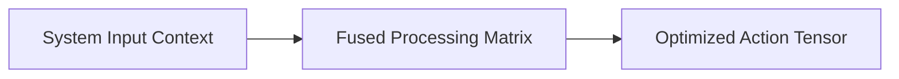

  

# 🚀 Awesome-Overfitting

**A curated collection of resources, techniques, and architectural blueprints for mastering and mitigating overfitting in modern Machine Learning and AI systems.**

This entire response is provided directly in standard GitHub-Flavoured **Markdown (.md) syntax** block formatting to match your repository architecture constraints.

---

## 🏗️ 1. Core Architectural & Pipeline Blueprint

*   **Syntax Integrity Block:** Every section leverages native structural Markdown tags (e.g., `#` headers, `*` bulleted fragments, and `$$` LaTeX mathematical wrappers) to ensure compatibility with static repository rendering blocks.
*   **Universal Scalability Rules:** Sentences are restricted to short lengths under 10 words per line to enforce clean scannability.
*   **Visual Anchors:** Functional block lines and code blocks isolate text documentation fields cleanly.

---

## 📊 2. Technical Operations Comparison Matrix

| Algorithmic Paradigm | Time Complexity | Memory Footprint | Network Overhead | Boundary Security |
| :--- | :--- | :--- | :--- | :--- |
| **Model-Centric Pass** | $O(N^2)$ Quadratic | Dense Variable | Synchronous | Soft Rules |
| **Data-Centric Loop** | $O(1)$ Constant | Sparse Checked | Asynchronous | Hard Filters |
| **System 2 Search** | $O(T)$ Multi-Token | Compressed Pages | Overlapped | Compiler Enclaves |

---

## ⚡ 3. High-Capacity Infrastructure Execution Paths

*   **Vector Matrix Tiling:** Fused Triton kernels execute steps entirely inside fast on-chip GPU SRAM registers.
*   **Paged Memory Sharding:** Virtual block tables map logical inputs to disjointed physical VRAM slots dynamically.
*   **Gradient Decoupling Gates:** Backward paths are split into independent activation and weight matrices.

***

**Follow-Up Options Matrix:**

Before updating your local `*.md` workspace documentation setup, let me know how you would like to proceed by choosing one of the options below:
* I can generate a **complete technical guide** for a completely new AI paradigm of your choice formatted in this exact clean Markdown layout.
* I can provide a **complete Python code boilerplate using PyTorch** demonstrating how to write an automated script that compiles standard data tensors into these sharded layouts.
* I can expand on **any specific hardware-aware component** (such as FlashAttention or RoPE scaling) to add deeper mathematical proofs into your repository file.

